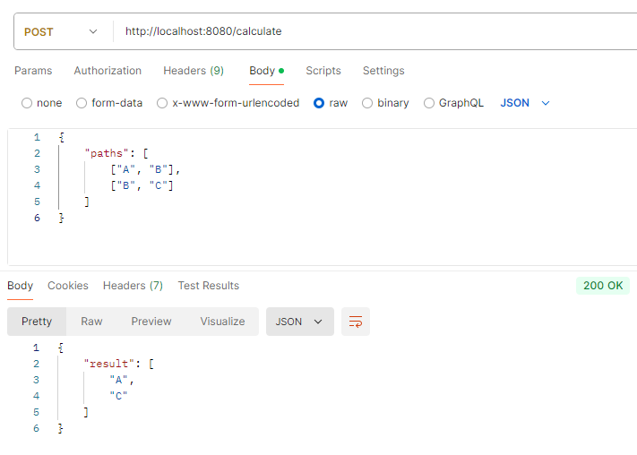

# Volumefi Assessment

## Description

This project is a simple Express.js application that provides an API for calculating start and end stations from given paths.

## API Endpoints

### POST /calculate

- **Description**: Accepts a JSON body containing an array of paths and returns the start and end stations.
- **Request Body**:
  ```json
  {
    "paths": [
      ["A", "B"],
      ["B", "C"]
    ]
  }
  ```
- **Response**:
  - **Success (200)**:
    ```json
    {
      "result": ["A", "C"]
    }
    ```
  - **Error (500)**: Returns an error message if the paths are invalid.

## Running the Application

1. Install dependencies:

   ```bash
   npm install
   ```

2. Start the server:

   ```bash
   npm start
   ```

## Example Testing with Postman


